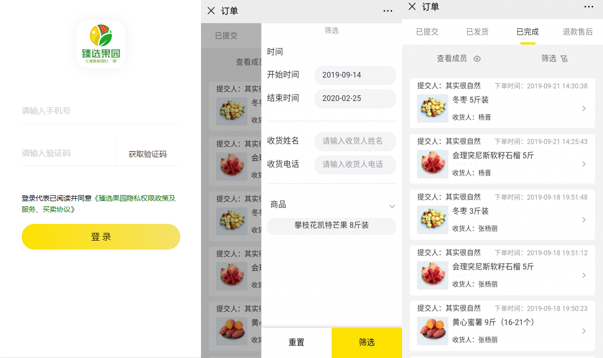

# 臻选果园

#### 介绍
该项目是一款h5订单录入系统前端界面

#### 项目截图

#### 微信接口

调用了微信的[JS-SDK](https://developers.weixin.qq.com/doc/offiaccount/OA_Web_Apps/JS-SDK.html)，使用了微信支付接口与分享接口。

#### 技术栈

 * Taro:是一个多端统一的开发解决方案，团队是京东的凹凸实验室，本次项目感觉没有将Taro的优点发挥出来，后面抽空看能否重构一下。
 * TaroUI:这是与Taro配套的UI库，也是唯一能接入的UI库
 * imgzip:图片压缩上传插件，将图片又base64转为blod流来进行上传

#### 难点总结

**1.关于Android与ios兼容性**

与小程序不同的是，在h5开发过程中遇到了多个与手机系统兼容性的问题。

第一个就是关于position:fixed这个属性在ios上定位失效，在android上的效果也不是很好，最后就放弃了这个属性。改用经典淘宝首页布局来解决。

第二个是在ios上input调起软键盘后不回弹的问题，Android上无此问题，但是对ios用户的体验很不好。解决方法：设置一个定时器，通过给input添加失去焦点事件，触发该事件的时候使页面自动滑动到顶部，体验后效果还不错。

#### 项目总结

这是我第一次接近真实的开发环境，经历了从项目的需求分析、需求变动，也经过将近20天的密集开发，到最后项目上线，到现在也迭代了几次版本。虽然开发过程不算很规范，但我也有很多收获，项目中也有一个前辈指导我，在前辈的耐心指导下，这个项目也慢慢做完，虽然还不是很完美，在代码精简度、一些布局还有性能优化上都还有很多空间。我想这些都是我下一步的计划。

